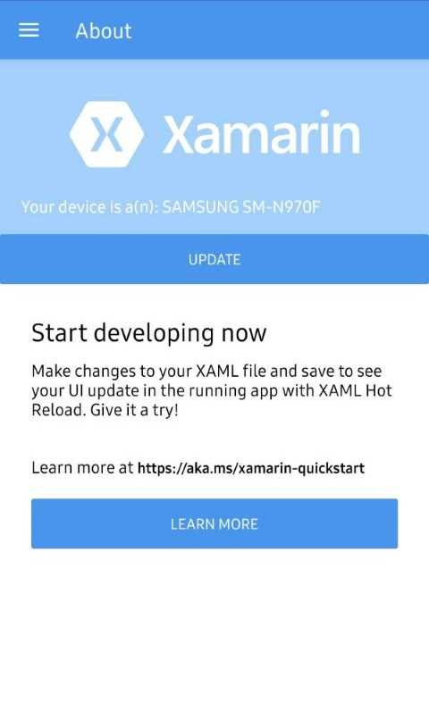
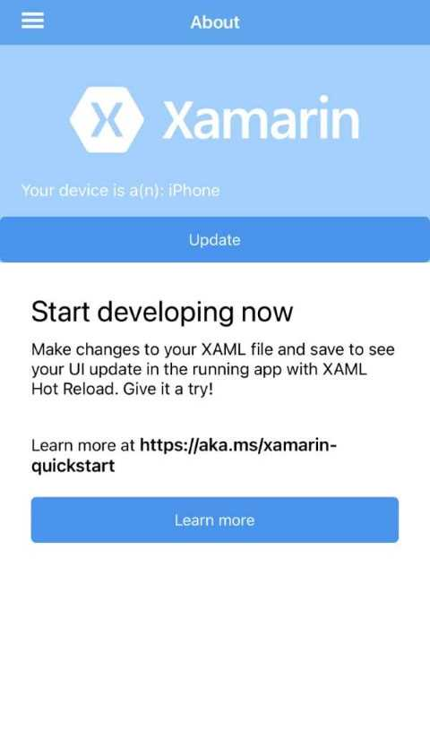

# BEIER360 Interview Test
## Contents
- [Setup Guide](https://github.com/ashleyswanson360-org/beier360-interview-test/blob/main/README.md#setup-guide)
- [Project Structure](https://github.com/ashleyswanson360-org/beier360-interview-test/blob/main/README.md#project-structure)
- [Tasks](https://github.com/ashleyswanson360-org/beier360-interview-test/blob/main/README.md#tasks)
  - [Task 1 - Fix](https://github.com/ashleyswanson360-org/beier360-interview-test/blob/main/README.md#tasks)
  - [Task 2 - Improve](https://github.com/ashleyswanson360-org/beier360-interview-test/blob/main/README.md#tasks)
  - [Task 3 - Implement](https://github.com/ashleyswanson360-org/beier360-interview-test/blob/main/README.md#tasks)
  - [Task 4 - Advanced (Optional)](https://github.com/ashleyswanson360-org/beier360-interview-test/blob/main/README.md#tasks)
- [How to Submit](https://github.com/ashleyswanson360-org/beier360-interview-test/blob/main/README.md#how-to-submit)
- [Support](https://github.com/ashleyswanson360-org/beier360-interview-test/blob/main/README.md#support)

## Setup Guide
To complete the test, you will be creating your own private repository from a template.

1. View this repository on GitHub, and click "Use this template". If you can't see this option, make sure you are signed in to GitHub.
2. Make sure the "Owner" is set to your **personal GitHub account**.
3. Make sure the "Visibility" is set to **Private**.
4. Give it a name and click "Create repository from template".

## Project Structure
The app is a modified version of the default Xamarin.Forms project. The solution consists of five projects.

- **InterviewApp:**
The cross-platform Xamarin.Forms project, containing all shared code.

- **InterviewApp.Android:**
The platform specific project for Android. This is the project you run when developing for Android.

- **InterviewApp.iOS:**
The platform specific project for iOS. This is the project you run when developing for iOS.

- **Libraries/InterviewApp.Basic:**
This is a cross-platform library that contains some common code. Defines the `Item` model and the `IDataStore` interface.

- **Libraries/InterviewApp.Advanced:**
This is a cross-platform library that provides an EF Core implementation of the `IDataStore` interface.

### App Features
The app currently has three main features.

- **About:**
A simple page that has a button to open Xamarin documentation, and a label to display the device's make and model.

- **Items:**
A list of items, each with a title and description. Each item can be opened in it's own detail page, and you can add new items.

- **Login:**
By logging out, you are taken to a login page and are unable to navigate to other pages in the app. Logging in returns you to the About page.

## Tasks
There are four tasks to complete.

1. **Fix:**
When pressing the Update button on the About page, to load the device's make and model, the app crashes. You need to debug and solve this issue.

2. **Improve:**
Make an improvement to any of the three existing features. This could be cleaning or optimising the code, or improving the user experience.

3. **Implement:**
Add a new feature to the app. Make sure you adhere to any third-party licences, and attribute any work that is not your own.
It should not require any preparation from us to test it. We should be able to download and immediately run your app.

4. **Advanced (optional):**
By default, the Items feature does not persist changes between sessions. The `InterviewApp.Advanced` library provides an implementation of the data store that persists the items to the device using EF Core and a SQLite database.
You can switch to use this advanced data store by defining the `ADVANCED` compilation symbol in the `InterviewApp` project settings. (Or you can uncomment the `DefineConstants` line when manually editing the `InterviewApp.csproj` file).
When using this advanced data store, the app will log an error when opening the Items page and will crash when trying to add a new item. You need to debug and solve this issue.
	
Please document your work and your thought-process, through commits, comments or just a log in a .txt file.

## How to Submit
When you have finished all of the tasks, ensure you follow these steps to submit your work.

1. View your private repository on GitHub, and go to "Settings > Collaborators > Add people".
2. Invite Ashley using his GitHub username `ashleyswanson360` or email `ashley.swanson@beier360.com`.
2. Reply to the invitation email with a link to your private repository.

## Support
### Links

- [Xamarin Documentation](https://docs.microsoft.com/en-us/xamarin/)
- [Installing Xamarin](https://docs.microsoft.com/en-us/xamarin/get-started/installation)
- [Xamarin.Forms Fundamentals](https://docs.microsoft.com/en-us/xamarin/xamarin-forms/app-fundamentals/)

### FAQs

**How long should this test take me?**

First of all, it's important to note that it can take different people varying amounts of time to complete the test. This could be because of your experience level, or just simply having more important things going on in your life. We don't want this to feel like an exam, but hope it's an interesting showcase of some typical tasks you will be undertaking at BEIER360, while also showing us your skill level in the sort of work we do. Please give us any feedback you have if you feel the test is too much.

To answer the question, assuming you spend your whole evenings on the test, we estimate it could take 1 or 2 nights to complete if you already have Xamarin experience. If you don't have experience with Xamarin or C# then it could take you an extra night or 2 to get to grips with it, depending on your experience level. Bare in mind that this is an estimate. As more people complete the test we should be able to improve that based on the real world data.

The important thing is, this _DOES NOT_ mean that you have a hard deadline of 4 days after receiving the invitation. Realistically, working around your schedule, we would expect a response in a week or so.

### Contact
If you need any help or guidance you can contact our Lead Software Developer, Ashley, by emailing him at `ashley.swanson@beier360.com`.
